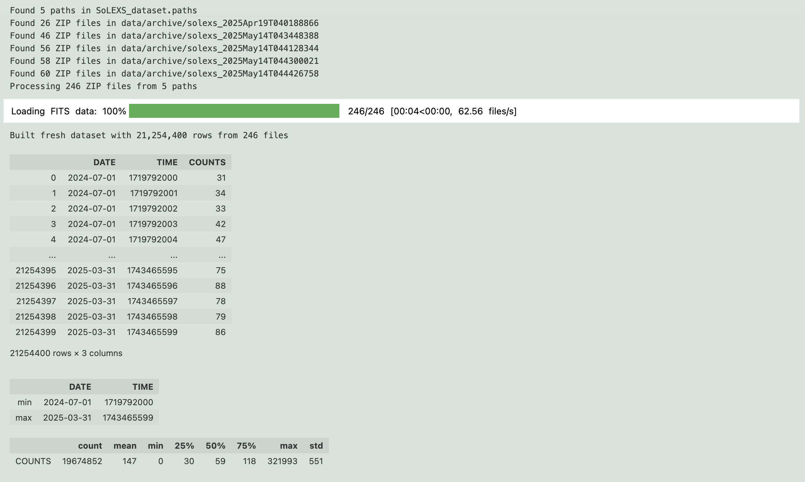
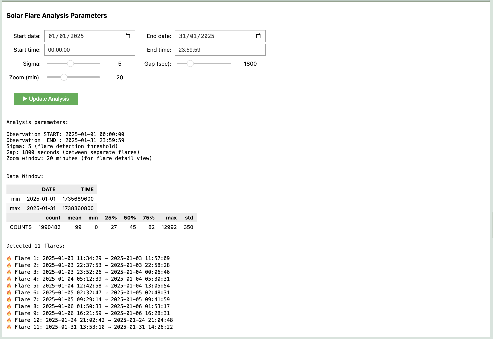
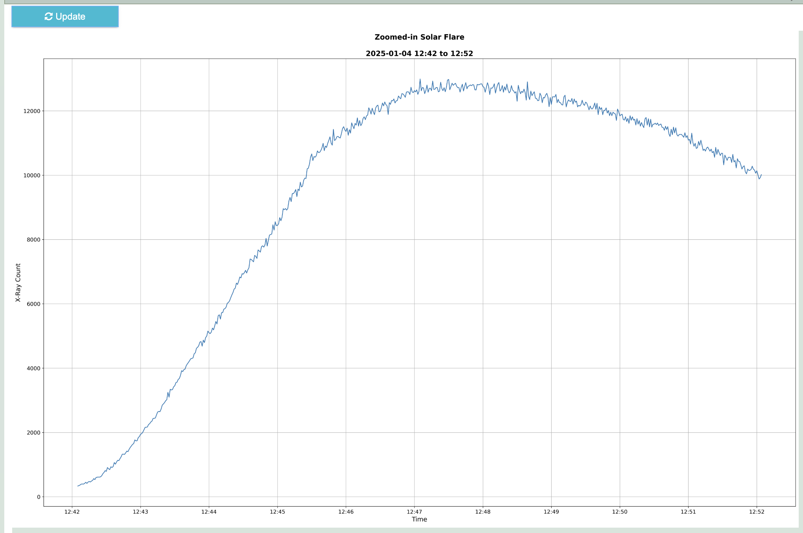

# SoLEXS Solar Flare Explorer

## TL;DR

Aditya-L1 is a solar observatory positioned 1.5 million kilometers from Earth at a place called the Lagrangian point L1, providing a continuous view of the Sun. SoLEXS is a spectrometer aboard Aditya-L1 that monitors X-ray emissions from the Sun, every second. This data is valuable for studying solar flares, which are bursts of energy released by the Sun. Now start exploring solar flares by forking the jupyter notebook: [`sun-explorer.ipynb`](sun-explorer.ipynb)

<div style="padding: 30px; font-size: 16px; line-height: 1.5; width: 600px">
<p>🛰️ 🛰️ 🛰️ 🛰️ 🛰️ 🛰️ 🛰️ 🛰️ 🛰️ 🛰️ <br><br> 🌞 A photon emitted on the surface of the Sun takes ≈494 seconds to reach Aditya-L1. Thereafter, the data generated and collected within SoLEXS is transmitted to ISSDC in Bengaluru – **a journey of ≈1.5 million Km in about 5 seconds** – where it is processed and made available to researchers. We are truly privileged! 😇</p>

</div>

## Introduction

"सूर्य आत्मा जगतस्तस्थुषश्च।" (Sūrya ātmā jagatastasthuṣaśca) - Rigveda

"The Sun is the soul of all that moves and stands still."

<div style="display: flex; padding-top: 20px; padding-bottom: 20px; justify-content: center;">
  
  
</div>

### **Aditya-L1 and a faraway place we call L1**

* On **September 2, 2023, 11:20 IST**, [ISRO](https://www.isro.gov.in/) launched [Aditya-L1](https://www.issdc.gov.in/adityal1.html), a space-based observatory-class mission to study the Sun.

* The satellite attained orbital insertion at [Lagrange Point 1](https://in.mashable.com/science/78263/isros-aditya-l1-completes-first-orbit-at-lagrange-point-1-what-is-it) (L1), ~1.5 million kilometers from Earth, on **January 6, 2024, 4:17 PM IST**, marking a significant milestone for India's first solar observatory.

* The advantage of being perched (in a halo orbit) at L1 is that Aditya-L1 has secured for itself an astronomical seat with a forever uninterrupted view of the Sun.

### **The Source of Our Data**

* The spacecraft carries seven payloads to observe the photosphere, chromosphere and the corona of the Sun. As far as this notebook is concerned, we will focus our attention on the **Solar Low Energy X-ray Spectrometer (SoLEXS)**, a sun-as-a-star spectrometer developed by the *U.R. Rao Satellite Centre, Bengaluru*.

* The primary science objectives of SoLEXS are:
  * [Flares and Coronal Heating](https://pubs.aip.org/physicstoday/article/76/4/34/2879433/Unveiling-the-mystery-of-solar-coronal)
  * [Coronal Abundances and FIP](https://link.springer.com/article/10.1007/s11207-020-01738-5)
  * [Flare – CME studies](https://www.sciencedirect.com/science/article/pii/S2090997712000235)

### **Getting to Know That Data**

* Solar flares are classified on a scale of A, B, C, M and X. Each class is 10 times stronger than the last, with X-class flares being the most powerful

* SoLEXS is capable of covering an extensive dynamic range from A-class to X-class flares. As we will see in the plots, when the Sun flares, the intensity of X-Ray counts can be several standard deviations above the mean.

* Data transmissions started soon after Aditya-L1 reached its destination and its instruments gradually came online. However, the dataset published by ISRO begins from July 1, 2024 onwards.

* ISRO releases data in tranches. The first tranche of solar datasets was released on January 6, 2025, marking the one-year anniversary of Aditya-L1's arrival at L1.

* SoLEXS data is hosted by ISRO's *Indian Space Science Data Centre* (ISSDC) on the [PRADAN portal](https://pradan1.issdc.gov.in/al1/), where one can access it after a quick registration process.

* The FITS (Flexible Image Transport System) is the data format of choice for astroniomical data. SoLEXS data files are provided as gzip compressed FITS files.

## Features

- *Efficient Data Processing*: Reads compressed FITS files directly from ZIP archives with optimized I/O operations. Ingest data at blazing speeds 🚀

- *Intelligent Data Management*: Reads data from multiple directories via a config file. Stores processed data in a `parquet` file for fast access 🚀

- *Robust Error Handling*: Includes smart caching and validation to handle data inconsistencies, ensuring reliable results even with large or incomplete datasets.

- *Automated Flare Detection*: Identifies solar flares using configurable window parameters and annotates them on a line plot 🚀

- *Interactive Analysis*: Provides widget-based date/time selection and parameter adjustment for rapid, fuss-free solar flare analysis 🚀

- *Dynamic Visualizations*: Offers real-time, interactive plots like light curves and zoomed-in flare details, providing clear insights into solar activity with smooth user-controlled refreshes.


## Installation (Simplified for Beginners)

Don't worry if you're new to this—installing and running the Solar Flare Analyzer is easy! Just follow these steps to get started.

### Step 1: Clone the Repository

Download the project files using this command in your terminal (or command prompt on Windows). If you don't have Git, you can download the ZIP from GitHub and unzip it:

```bash
git clone https://github.com/thecont1/aditya-L1-solar-explorer.git
```

### Step 2: Create a Virtual Environment (Optional but Helpful)

This step keeps everything organized and prevents issues with other programs. Run these commands in your terminal:

* Create the environment: `python -m venv env`
* Activate it:
  * On Windows: `env\Scripts\activate`
  * On macOS/Linux: `source env/bin/activate`

### Step 3: Install the Required Tools

Install the necessary packages with one simple command. Make sure your virtual environment is activated if you created one:

```bash
pip install numpy pandas matplotlib astropy tqdm ipywidgets jupyter-ui-poll ipydatetime
```

### Step 4: Set Up Interactive Features (If Needed)

To make the interface work smoothly, enable Jupyter widgets with this command:

```bash
jupyter nbextension enable --py widgetsnbextension
```

### Step 5: Launch the Analyzer

Open the notebook in Jupyter to start exploring solar flares:

```bash
jupyter notebook
```
Then, find and open `sun-explorer.ipynb` in your browser.

You're all set! If you run into any issues, check the troubleshooting section or let us know.

## Files

### **Data Setup**:
   * Place your Aditya-L1 SoLEXS ZIP files in a directory
   * Create a `SoLEXS_dataset.paths` file listing the directories containing your data

The tool expects Aditya-L1 SoLEXS data in ZIP files with the following structure:

```text
AL1_SLX_L1_YYYYMMDD_v1.0.zip
└── AL1_SLX_L1_YYYYMMDD_v1.0/
    └── SDD2/
        └── AL1_SOLEXS_YYYYMMDD_SDD2_L1.lc.gz
```

The processed data is stored in a Parquet file (`SoLEXS_dataset.parquet`) with the following columns:

* `DATE`: Observation date
* `TIME`: Seconds since midnight
* `COUNTS`: X-ray counts

### **Run the Notebook**:
   * Open `sun-explorer.ipynb` in Jupyter
   * Run all cells to load data and initialize the interface

## Usage Guide

### Getting Started

When you launch the Solar Flare Explorer notebook, it will automatically load the SoLEXS data from the configured paths. You'll see a loading progress bar and a summary of the data similar to this:



This indicates the notebook has successfully processed the solar data files and created a `SoLEXS_dataset.parquet` datafile ready for analysis. 

**As you can see, the dataset contains over 21 million consecutive seconds of observation, from July 1, 2024 to March 31, 2025.** However, due to space limitations on GitHub, the dataset available here is for a subset of this period.

### Customizing Your Analysis

The interactive control panel allows you to select specific time periods and adjust detection parameters:



* **Date and Time Selection**: Choose the start and end dates/times to focus on a specific observation period
* **Sigma**: Controls the sensitivity of flare detection (higher values detect only stronger flares)
* **Gap**: Sets the minimum time (in seconds) between separate flares
* **Zoom**: Determines how many minutes to display when viewing a single flare in detail
* **Update Analysis**: Click this button to refresh the analysis with your new settings

### Exploring Solar Flares

After updating the analysis, you'll see a light curve showing X-ray activity from the Sun during your selected period:


* The **blue line** shows the X-ray count rate over time
* The **green line** shows the median count level
* The **red line** shows the detection threshold (median + sigma × standard deviation)
* **Pink labels** mark detected flares with their peak times

### Examining Individual Flares

The final plot shows a zoomed-in view of the largest solar flare detected in the previous step. To observe any other flare, adjust the time window so that the flare of your choice is visible in the light curve plot, click <span style="background-color: #00aa00; color: white; padding: 3px 5px 3px 5px;">▶︎Update Analysis</span> and then come back here and click <span style="background-color: #00b0b0; color: white; padding: 3px 5px 3px 5px;">🔄Update</span>:



This zoomed view shows the detailed structure of the flare, allowing you to observe the rapid rise in X-ray emission followed by a more gradual decline - the characteristic signature of a solar flare.

To continue your exploration, simply adjust the parameters in the control panel and click "Update Analysis" to discover more solar activity!

## Acknowledgements

🫡 Indian Space Research Organisation (ISRO) for the Aditya-L1 mission

🫡 The scientists and engineers for the SoLEXS instrument and data

## License

This project is licensed under the MIT License - see the LICENSE file for details.